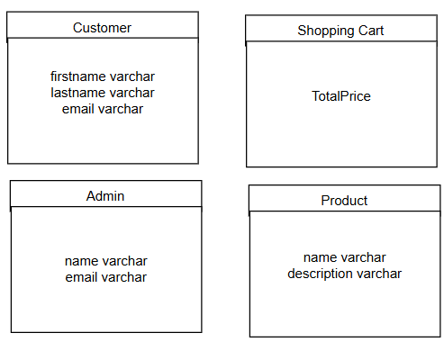

# Milestone 2
- Author: Ashley Barron
- Application Name: Music Store
- Class: CST-391
- Title: Milestone 2

# Instuctor Feedback
- Ashley, excellent work on this assignment

# Response to Feedback
- No specific changes were made for the milestone as the past one met all requirements. 

# Introcue your rest API
- *start here

# Introduction
 - For this milestone I plan on creating a music store. The store will sell a variety of products, including musical instruments such as guitars and pianos, accessories like guitar picks and strings, and music media such as CDs and DVDs.

- The application will allow users to browse and manage these products through a simple back-end and front-end system, combining functionality for listing, creating, reading, updating, and deleting a "product". This milestone will help demonstrate the application of back-end and front-end technologies, including the use of databases, REST APIs, and user interfaces. 

# Functionality Requirements
1. As a customer, I want to browse a list of available products to explore the music store's inventory. 
2. As a customer, I want to view details of a specific product to learn more about it before purchasing. 
3. As a customer, I want to search for specific items using keywords or categories. 

4. As a store user, I want to be able to delete products that may not be available in the store anymore. 
5. As a store user, I want to be able to add new products to the store's inventory.
6. As a store user, I want to update any details to the store's products so that its information can be accurate. 

# ER Diagram

# UI Sitemap Diagram

# UI Wireframe

# UML Classes

# Risks
- Database Design Issues: Later on, it's possible that the database might need adjustments such as new requirements or adding/removing more products. 

- Time Management: Balancing multiple classes and milestones could make time management challenging. There's a risk of running short on time for completing tasks, especially as deadlines overlap or unexpected complications arise. 

- Technical Debt: Rushing through the initial stages of development to meet deadlines could lead to inefficient solutions or messy code. 