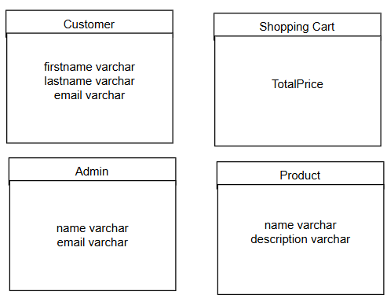

# Milestone 3
- Author: Ashley Barron
- Application Name: Music Store
- Class: CST-391
- Title: Milestone 3

# Introduction
- For my milestone, I'm developing a web application for a music store. In this store, I will be selling a variety of products such as musical instruments (guitars, drum kits, and violins), accessories (guitar picks, violin bows, and drumsticks), and Media (CDs, DVDs, and vinyl records). The application will allow users to browse through a simple back-end and front-end system, providing  functionality for reading, creating, listing, listing, updating, and deleting an item/product from the store. This milestone will desmonstrate the application's bacn-end and front-end technologies, including the use of Databases, REST APIs, and user interfaces. 

# Changes 
- ** For the milestone I made a few changes. One was where I changed the instrument "battery" to "drum kit" to make it a bit more clear and avoid confusion. In future milestones I may add a piano or other instruments. The three instruments I chose are to get me going for the beggining of the milestone. I may do the same for accessories. I may add guitar strings, or objects to clean instruments. For media I could add music sheets, or bue ray disks. 
- Another change I made was in the REST Endpoints. In the previous milestone I implemented GET, PUT, and DELETE. In this milestone, I added POST endpoint, which allows the user to add a music item to their shopping cart.


# Requirements
- **The application must ...

# Sitemap


# Wireframes


# Database Design


# Class Diagrams


# REST Endpoints
- **The Endpoints used in this milestone are designed to interact with the music store's inventory, allowing users to perform tasks such as updating, retrieving, and deleting products. These endpoints are structured to follow the REST conventions, ensuring ease of use when managing instruments, their accessories, and media items. 

<br>

|**Method** | **Endpoint**     |   **Description**|
|------------|--------------------|--------------------------------------------|
|GET|   instruments    |   Retrieve a list of all instruments|
|GET|   accessories  | Retrieve a list of all accessories|
|GET|   media   |   Retrieve a list of all media|
|POST|  instruments   |Add a new instrument to the shopping cart|
|POST| accessories  | Add a new accessory to the shopping cart|
|POST| media  | Add a new media to the shopping cart|
|DELETE|    instruments/:id     |   Delete an instrument by its ID|
|DELETE|    accessories/:id     |   Delete an accessory by its ID|
|DELETE|    media/:id           |   Delete a media by its ID|
|PUT|   instruments/:id     |   Update an instrument by its ID|
|PUT|   accessories/:id      |   Update an accessory by its ID|
|PUT|   media/:id           |   Update a media by its ID|


# Intro API?
- **gddghs


# API Requests

## GET
### Instruments

```json
  GET /instruments
  Response:
[
    {
        "id": 1,
        "type": "guitar",
        "brand": "Martin",
        "model": "D-28"
    },
    {
        "id": 2,
        "type": "drum kit",
        "brand": "Tama",
        "model": "Imperialstar"
    },
    {
        "id": 3,
        "type": "violin",
        "brand": "Yamaha",
        "model": "AV7"
    }
]
```

### Accessories
```json
  GET /accessories
  Response:
  [
    {
        "id": 4,
        "type": "guitar pick",
    },
    {
        "id": 5,
        "type": "violin bow",
    },
    {
        "id": 6,
        "type": "drumstick"
    }
  ]
```

### Media
```json
  GET /media
  Response:
[
    {
        "id": 7,
        "type": "CDs",
        "artist": "Lady Gaga",
        "albumTitle": "The Fame Monster",
        "releaseYear": 2009
    },
    {
        "id": 8,
        "type": "DVDs",
        "artist": "Taylor Swift",
        "albumTitle": "1989",
        "releaseYear": 2014
    },
    {
        "id": 9,
        "type": "vinyl",
        "artist": "Billie Eilish",
        "albumTitle": "Don't smile at me",
        "releaseYear": 2017
    }
]
```

## POST
### Instruments
```json
 POST /instruments
 Response:
 {
    "message": "Instrument added!",
    "data":
    [
        {
        "id": 1,
        "type": "guitar",
        "brand": "Martin",
        "model": "D-28"
        },
        {
        "id": 2,
        "type": "drum kit",
        "brand": "Tama",
        "model": "Imperialstar"
        },
        {
        "id": 3,
        "type": "violin",
        "brand": "Yamaha",
        "model": "AV7"
        }
    ]
}
```

### Accessories
``` json
    POST /accessories
    Response:
    {
        "message": "Accessory added!",
        "data":
        [
            {
                "id": 4,
                "type": "guitar pick"
            },
            {
                "id": 5,
                "type": "violin bow"
            },
            {
                "id": 6,
                "type": "drumstick"
            }
        ]
    }
```

### Media
``` json
    POST /media
    Response:
    {
        "message": "Media added!",
        "data":
        [
            {
                "id": 7,
                "type": "CDs",
                "artist": "Lady Gaga",
                "albumTitle": "The Fame Monster",
                "releaseYear": 2009
            },
            {
                "id": 8,
                "type": "DVDs",
                "artist": "Taylor Swift",
                "albumTitle": "1989",
                "releaseYear": 2014
            },
            {
                "id": 9,
                "type": "vinyl",
                "artist": "Billie Eilish",
                "albumTitle": "Don't smile at me",
                "releaseYear": 2017
            }
        ]
    }
```

## PUT
### Instruments
```json
  PUT /instruments
  Response:

[
    {
        "message": "Instrument Updated!",
        "data":
        {
            "id": 1,
            "type": "guitar",
            "brand": "Martin",
            "model": "D-28"
        }
    },
    {
        "message": "Instrument Updated!",
        "data":
        {
            "id": 2,
            "type": "drum kit",
            "brand": "Tama",
            "model": "Imperialstar"
        }
    },
    {
        "message": "Instrument Updated!",
        "data":
        {
            "id": 3,
            "type": "violin",
            "brand": "Yamaha",
            "model": "AV7"
        }
    }
]
```

### Accessories
```json
    PUT /accessories
    Response:
    [
        {
            "message": "Accessory Updated!",
            "data":
            {
                "id": 4,
                "type": "guitar pick"
            }
        },
        {
            "message": "Accessory Updated!",
            "data":
            {
                "id": 5,
                "type": "violin bow"
            }
        },
        {
            "message": "Accessory Updated!",
            "data":
            {
                "id": 6,
                "type": "drumstick"
            }
        }
    ]
```

### Media
```json
  PUT /media
  Response:
  [
    {
        "message": "Media Updated!",
        "data":
        {
            "id": 7,
            "type": "CDs",
            "artist": "Lady Gaga",
            "albumTitle": "The Fame Monster",
            "releaseYear": 2009
        }
    },
    {
            "message": "Media Updated",
            "data":
            {
                "id": 8,
                "type": "DVDs",
                "artist": "Taylor Swift",
                "albumTitle": "1989",
                "releaseYear": 2014
            }
    },
    {
        "message": "Media Updated!",
        "data":
        {
            "id": 9,
            "type": "vinyl",
            "artist": "Billie Eilish",
            "albumTitle": "Don't smile at me",
            "releaseYear": 2017
        }
    }
  ]
```

## DELETE
### Instruments
```json
    DELETE /instrument/1
    Response:
    
        {
            "message": "Instrument Deleted!",
            "data":
            {
                "id": 1,
                "type": "guitar",
                "brand": "Martin",
                "model": "D-28"
            }
        },
        DELETE /instrument/2
        Response:
        {
            "message": "Instrument Deleted!",
            "data":
            {
                "id": 2,
                "type": "drum kit",
                "brand": "Tama",
                "model": "Imperialstar"
            }
        },
        DELETE /instrument/3
        Response:
        {            
            "message": "Instrument Deleted!",
            "data":
            {
                "id": 3,
                "type": "violin",
                "brand": "Yamaha",
                "model": "AV7"
            }
        }
```

### Accessories
```json
    DELETE /accessory/4
    Response:
    
        {
            "message": "Accessory Deleted!",
            "data":
            {
                "id": 4,
                "type": "guitar pick"
            }
        },
        DELETE /accessory/5
        Response:
        {
            "message": "Accessory Deleted!",
            "data":
            {
                "id": 5,
                "type": "violin bow"
            }
        },
        DELETE /accessory/6
        Response:
        {
            "message": "Accessory Deleted!",
            "data":
            {
                "id": 6,
                "type": "drumstick"
            }
        }
```

### Media
```json
    DELETE /media/7
    Response:
    
        {
            "message": "Media Deleted!",
            "data":
            {
                "id": 7,
                "type": "CDs",
                "artist": "Lady Gaga",
                "albumTitle": "The Fame Monster",
                "releaseYear": 2009
            }
        },
        DELETE /media/8
        Response:
        {
            "message": "Media Deleted!",
            "data":
            {
                "id": 8,
                "type": "DVDs",
                "artist": "Taylor Swift",
                "albumTitle": "1989",
                "releaseYear": 2014
            }
        },
        DELETE /media/9
        Response:
        {
            "message": "Media Deleted!",
            "data":
            {
                "id": 9,
                "type": "vinyl",
                "artist": "Billie Eilish",
                "albumTitle": "Don't smile at me",
                "releaseYear": 2017
            }
        }
```


# ** To-do?
