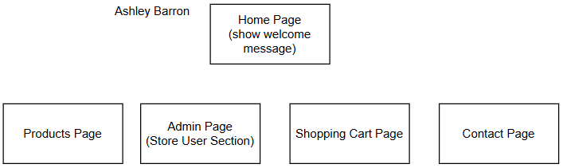
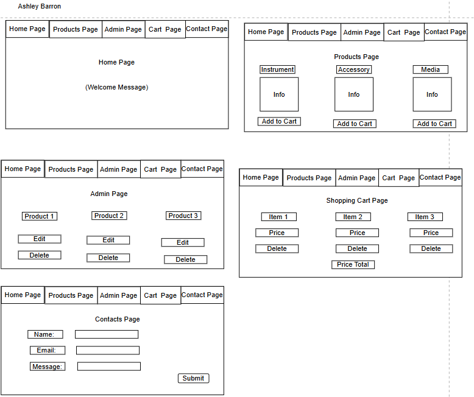
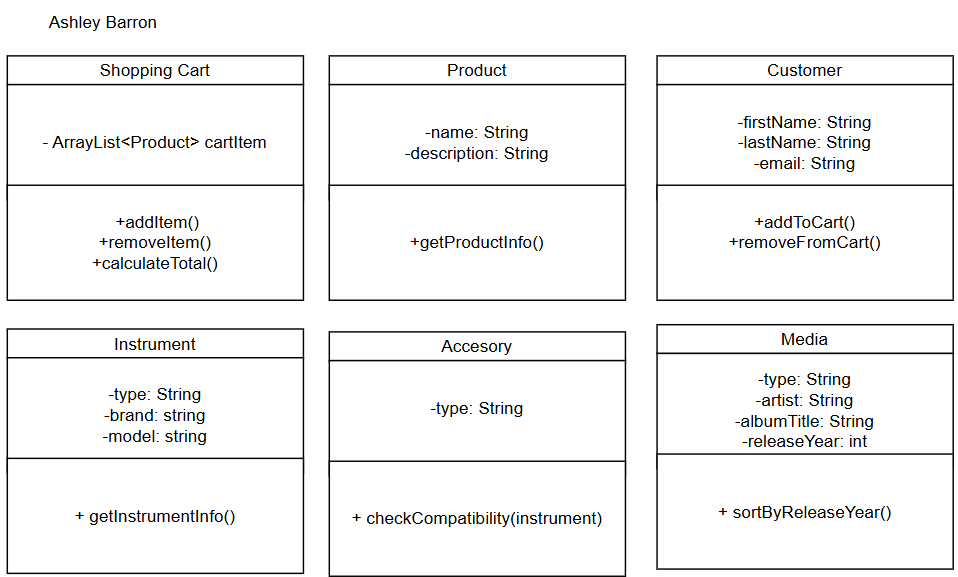

# Milestone 5
- Author: Ashley Barron
- Application Name: Music Store
- Class: CST-391
- Title: Milestone 5

# Introduction
- For my milestone, I'm now developing the music store application. In this store, I'm selling a variety of products such as musical instruments (guitars, drum kits, and violins), accessories (guitar picks, violin bows, and drumsticks), and Media (CDs, DVDs, and vinyl records). The application will allow users to browse through a simple back-end and front-end system, providing  functionality for reading, creating, listing, listing, updating, and deleting an item/product from the store. This milestone will desmonstrate the application's back-end and front-end technologies, including the use of REST APIs and user interfaces. 

**Screencast*

[Powerpoint](https://1drv.ms/p/c/fc1efc517c6a978f/EVnN4cVzLMtAoHYFz1crcJ8BGqSq2YUlIZXU0dIwAGd4zw?e=mjfSuk)

# Changes/Updates
-*For the milestone, I'm developing my music store 
# Table Updates

|**Update** | **Description** | **Status** | **Known Issues** |
|-----------|-----------------|-------------|-----------------|
| N/A | N/A | N/A | N/A |


# Requirements
1. As a customer, I want to browse a list of available products to explore the music store's inventory.

2. s a customer, I want to view details of a specific product to learn more about it before purchasing.

3. As a customer, I want to search for specific items using keywords or categories.

4. As a store user, I want to be able to delete products that may not be available in the store anymore.

5. As a store user, I want to be able to add new products to the store's inventory.

6. As a store user, I want to update any details to the store's products so that its information can be accurate.

# Sitemap


# Wireframes


# Database Design


# Class Diagrams


# REST Endpoints
- The Endpoints used in this milestone are designed to interact with the music store's inventory, allowing users to perform tasks such as updating, retrieving, and deleting products. These endpoints are structured to follow the REST conventions, ensuring ease of use when managing instruments, their accessories, and media items. 

<br>


|**Method** | **Endpoint**     |   **Description**|
|------------|--------------------|--------------------------------------------|
|GET|   instruments    |   Retrieve a list of all instruments|
|GET|   accessories  | Retrieve a list of all accessories|
|GET|   media   |   Retrieve a list of all media|
|POST|  instruments   |Add a new instrument to the shopping cart|
|POST| accessories  | Add a new accessory to the shopping cart|
|POST| media  | Add a new media to the shopping cart|
|DELETE|    instruments/:id     |   Delete an instrument by its ID|
|DELETE|    accessories/:id     |   Delete an accessory by its ID|
|DELETE|    media/:id           |   Delete a media by its ID|
|PUT|   instruments/:id     |   Update an instrument by its ID|
|PUT|   accessories/:id      |   Update an accessory by its ID|
|PUT|   media/:id           |   Update a media by its ID|


# API Introduction
- The API of this project is designed to provide a straightforward and efficient way for users to manage products. Users can retrieve information about products of their choice, add new products, or delete existing ones. This structure ensures flexibility and ease of use for various product management operations.


# API Requests

## GET
### Instruments

```json
  GET /instruments
  Response:
[
    {
        "id": 1,
        "type": "guitar",
        "brand": "Martin",
        "model": "D-28"
    },
    {
        "id": 2,
        "type": "drum kit",
        "brand": "Tama",
        "model": "Imperialstar"
    },
    {
        "id": 3,
        "type": "violin",
        "brand": "Yamaha",
        "model": "AV7"
    }
]
```

### Accessories
```json
  GET /accessories
  Response:
  [
    {
        "id": 4,
        "type": "guitar pick",
    },
    {
        "id": 5,
        "type": "violin bow",
    },
    {
        "id": 6,
        "type": "drumstick"
    }
  ]
```

### Media
```json
  GET /media
  Response:
[
    {
        "id": 7,
        "type": "CDs",
        "artist": "Lady Gaga",
        "albumTitle": "The Fame Monster",
        "releaseYear": 2009
    },
    {
        "id": 8,
        "type": "DVDs",
        "artist": "Taylor Swift",
        "albumTitle": "1989",
        "releaseYear": 2014
    },
    {
        "id": 9,
        "type": "vinyl",
        "artist": "Billie Eilish",
        "albumTitle": "Don't smile at me",
        "releaseYear": 2017
    }
]
```

## POST
### Instruments
```json
 POST /instruments
 Response:
 {
    "message": "Instrument added!",
    "data":
    [
        {
        "id": 1,
        "type": "guitar",
        "brand": "Martin",
        "model": "D-28"
        },
        {
        "id": 2,
        "type": "drum kit",
        "brand": "Tama",
        "model": "Imperialstar"
        },
        {
        "id": 3,
        "type": "violin",
        "brand": "Yamaha",
        "model": "AV7"
        }
    ]
}
```

### Accessories
``` json
    POST /accessories
    Response:
    {
        "message": "Accessory added!",
        "data":
        [
            {
                "id": 4,
                "type": "guitar pick"
            },
            {
                "id": 5,
                "type": "violin bow"
            },
            {
                "id": 6,
                "type": "drumstick"
            }
        ]
    }
```

### Media
``` json
    POST /media
    Response:
    {
        "message": "Media added!",
        "data":
        [
            {
                "id": 7,
                "type": "CDs",
                "artist": "Lady Gaga",
                "albumTitle": "The Fame Monster",
                "releaseYear": 2009
            },
            {
                "id": 8,
                "type": "DVDs",
                "artist": "Taylor Swift",
                "albumTitle": "1989",
                "releaseYear": 2014
            },
            {
                "id": 9,
                "type": "vinyl",
                "artist": "Billie Eilish",
                "albumTitle": "Don't smile at me",
                "releaseYear": 2017
            }
        ]
    }
```

## PUT
### Instruments
```json
  PUT /instruments
  Response:

[
    {
        "message": "Instrument Updated!",
        "data":
        {
            "id": 1,
            "type": "guitar",
            "brand": "Martin",
            "model": "D-28"
        }
    },
    {
        "message": "Instrument Updated!",
        "data":
        {
            "id": 2,
            "type": "drum kit",
            "brand": "Tama",
            "model": "Imperialstar"
        }
    },
    {
        "message": "Instrument Updated!",
        "data":
        {
            "id": 3,
            "type": "violin",
            "brand": "Yamaha",
            "model": "AV7"
        }
    }
]
```

### Accessories
```json
    PUT /accessories
    Response:
    [
        {
            "message": "Accessory Updated!",
            "data":
            {
                "id": 4,
                "type": "guitar pick"
            }
        },
        {
            "message": "Accessory Updated!",
            "data":
            {
                "id": 5,
                "type": "violin bow"
            }
        },
        {
            "message": "Accessory Updated!",
            "data":
            {
                "id": 6,
                "type": "drumstick"
            }
        }
    ]
```

### Media
```json
  PUT /media
  Response:
  [
    {
        "message": "Media Updated!",
        "data":
        {
            "id": 7,
            "type": "CDs",
            "artist": "Lady Gaga",
            "albumTitle": "The Fame Monster",
            "releaseYear": 2009
        }
    },
    {
            "message": "Media Updated",
            "data":
            {
                "id": 8,
                "type": "DVDs",
                "artist": "Taylor Swift",
                "albumTitle": "1989",
                "releaseYear": 2014
            }
    },
    {
        "message": "Media Updated!",
        "data":
        {
            "id": 9,
            "type": "vinyl",
            "artist": "Billie Eilish",
            "albumTitle": "Don't smile at me",
            "releaseYear": 2017
        }
    }
  ]
```

## DELETE
### Instruments
```json
    DELETE /instrument/1
    Response:
    
        {
            "message": "Instrument Deleted!",
            "data":
            {
                "id": 1,
                "type": "guitar",
                "brand": "Martin",
                "model": "D-28"
            }
        },
        DELETE /instrument/2
        Response:
        {
            "message": "Instrument Deleted!",
            "data":
            {
                "id": 2,
                "type": "drum kit",
                "brand": "Tama",
                "model": "Imperialstar"
            }
        },
        DELETE /instrument/3
        Response:
        {            
            "message": "Instrument Deleted!",
            "data":
            {
                "id": 3,
                "type": "violin",
                "brand": "Yamaha",
                "model": "AV7"
            }
        }
```

### Accessories
```json
    DELETE /accessory/4
    Response:
    
        {
            "message": "Accessory Deleted!",
            "data":
            {
                "id": 4,
                "type": "guitar pick"
            }
        },
        DELETE /accessory/5
        Response:
        {
            "message": "Accessory Deleted!",
            "data":
            {
                "id": 5,
                "type": "violin bow"
            }
        },
        DELETE /accessory/6
        Response:
        {
            "message": "Accessory Deleted!",
            "data":
            {
                "id": 6,
                "type": "drumstick"
            }
        }
```

### Media
```json
    DELETE /media/7
    Response:
    
        {
            "message": "Media Deleted!",
            "data":
            {
                "id": 7,
                "type": "CDs",
                "artist": "Lady Gaga",
                "albumTitle": "The Fame Monster",
                "releaseYear": 2009
            }
        },
        DELETE /media/8
        Response:
        {
            "message": "Media Deleted!",
            "data":
            {
                "id": 8,
                "type": "DVDs",
                "artist": "Taylor Swift",
                "albumTitle": "1989",
                "releaseYear": 2014
            }
        },
        DELETE /media/9
        Response:
        {
            "message": "Media Deleted!",
            "data":
            {
                "id": 9,
                "type": "vinyl",
                "artist": "Billie Eilish",
                "albumTitle": "Don't smile at me",
                "releaseYear": 2017
            }
        }
```
